# Face Embedding Visualizations Summary

This document summarizes the advanced visualizations created for the face embedding gender prediction project.

## Data Visualizations

### 1. Gender Distribution
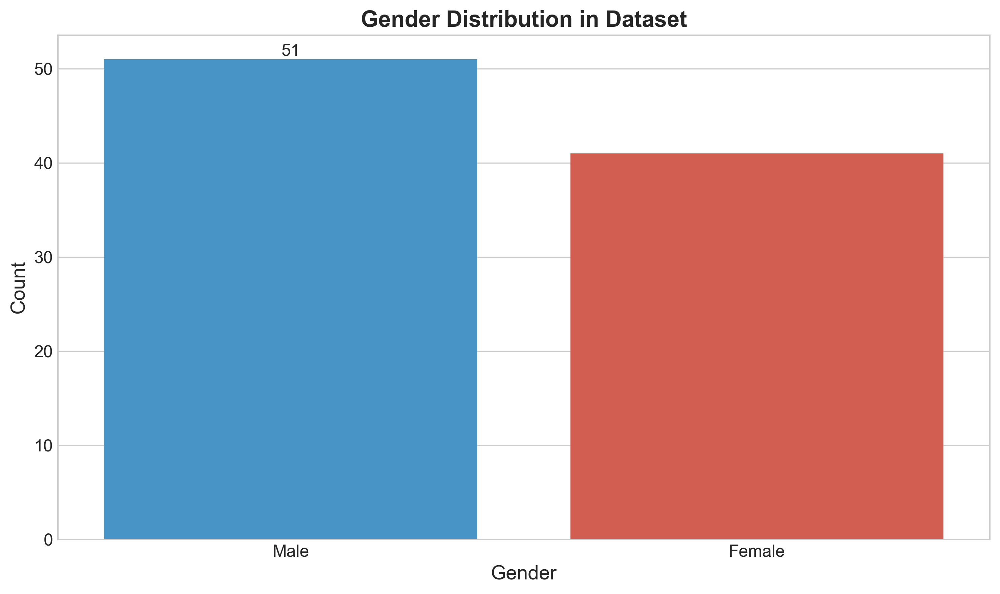

This visualization shows the distribution of male and female samples in our dataset, helping us understand any potential class imbalance.

### 2. PCA Visualization
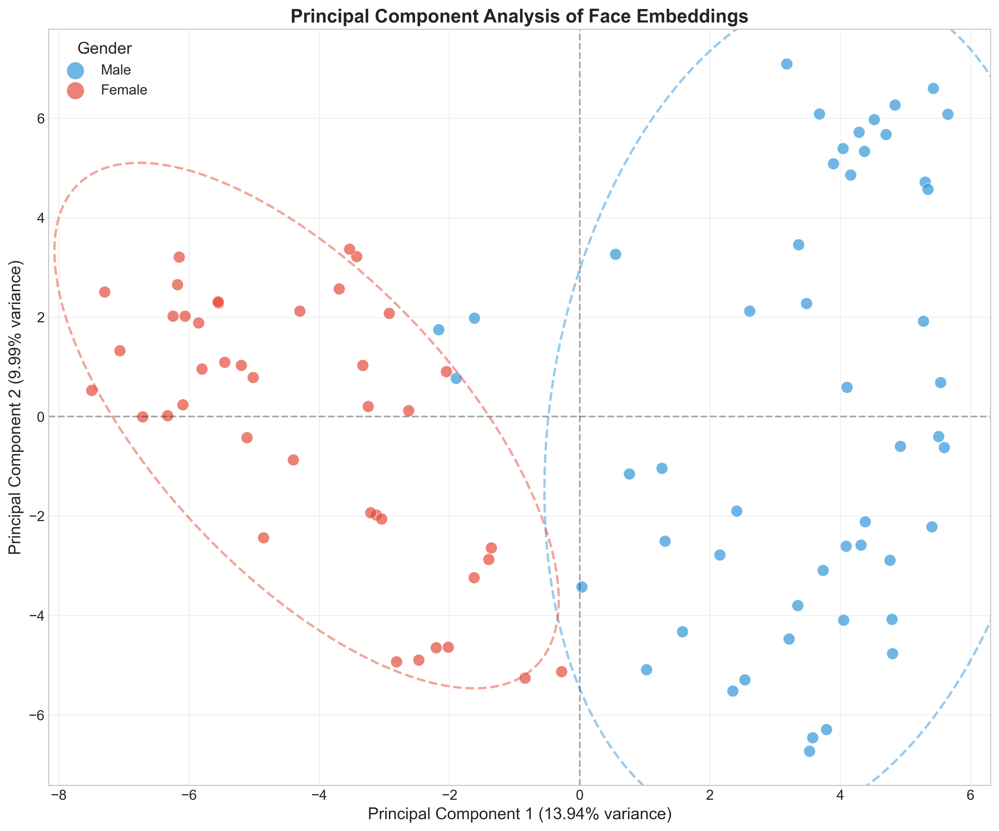

Principal Component Analysis (PCA) reduces our 128-dimensional embedding space to just 2 dimensions, showing a clear separation between male and female face embeddings. The dotted ellipses represent 95% confidence regions.

### 3. 3D PCA Visualization
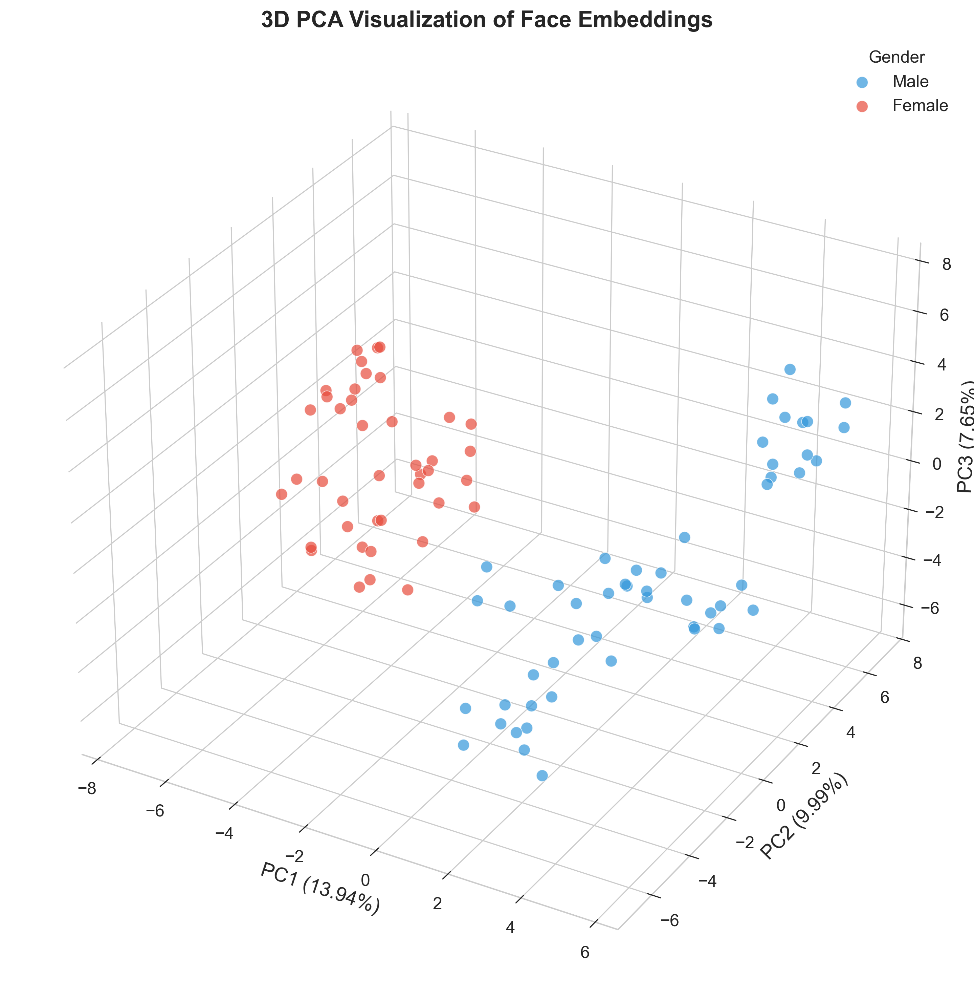

This 3D representation using the first three principal components provides another perspective on how gender separates in the embedding space.

### 4. t-SNE Visualization
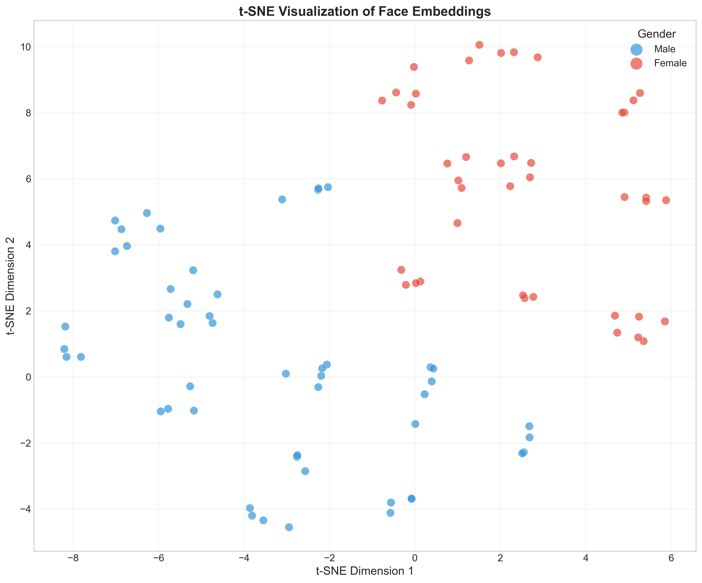

t-SNE is a more advanced dimensionality reduction technique that preserves local structure, often revealing more complex clustering patterns than PCA.

## Feature Analysis

### 5. Cumulative Explained Variance
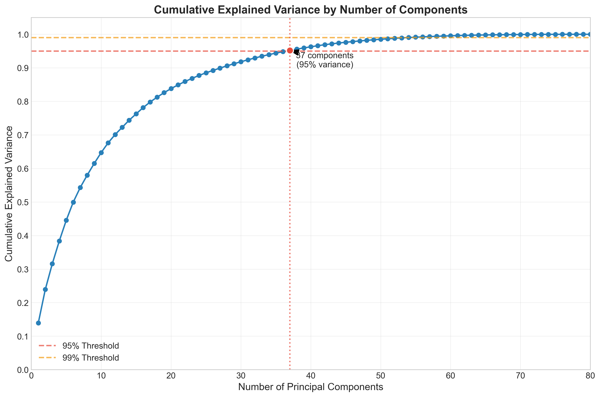

This plot shows how many principal components are needed to explain various percentages of the variance in our data. It helps us determine the optimal dimensionality for our models.

### 6. Feature Importance
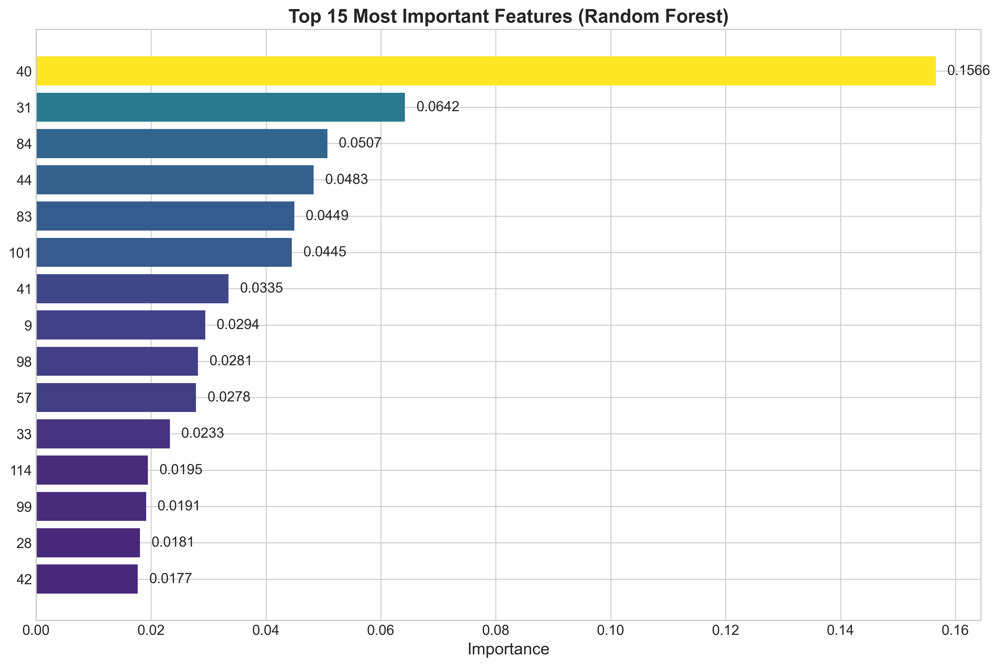

The Random Forest algorithm identifies which of the 128 embedding dimensions are most important for gender prediction. This visualization helps us understand which features are most gender-predictive.

### 7. Feature Correlation
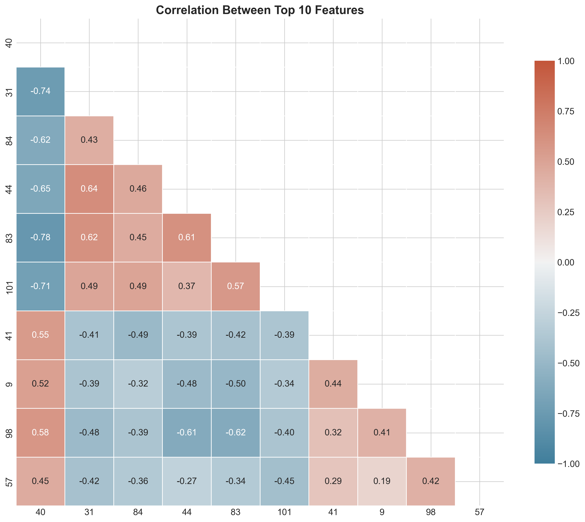

This heatmap shows how the top gender-predictive features correlate with each other, helping identify redundant information.

## Model Performance

### 8. Learning Curve
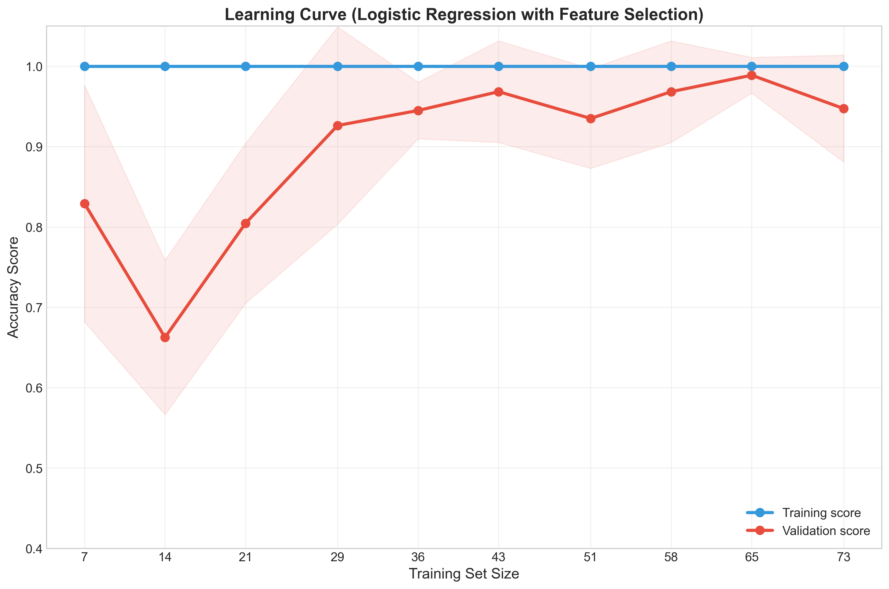

The learning curve shows how model performance changes with increasing training data size. The gap between training and validation performance helps identify overfitting or underfitting issues.

### 9. Validation Curve
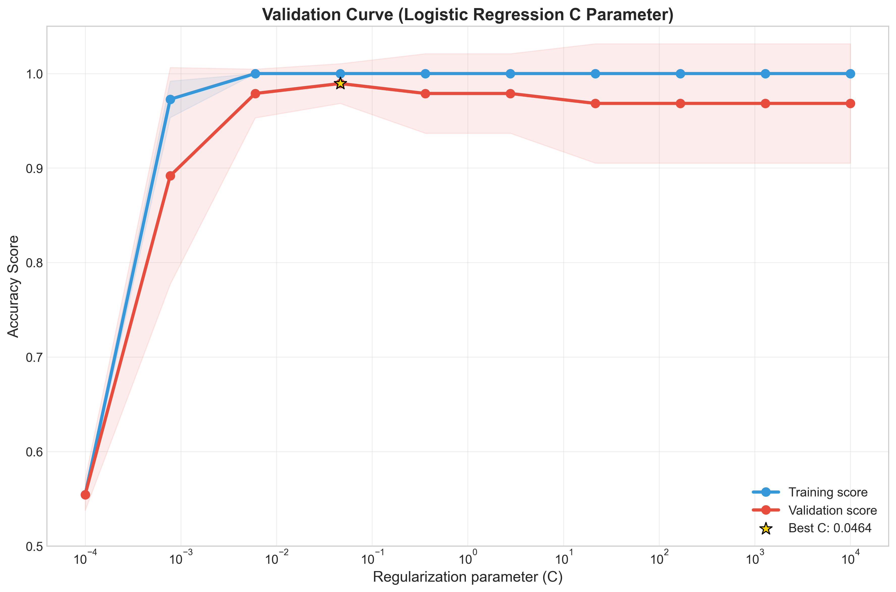

This curve shows how the model's regularization parameter (C) affects performance, helping identify the optimal level of regularization.

### 10. Model Comparison
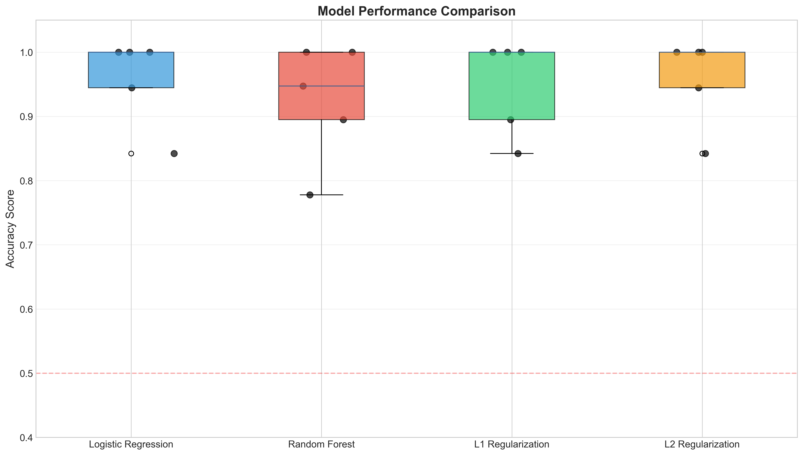

This visualization compares the performance of different models and regularization techniques on our gender prediction task.

### 11. Dashboard
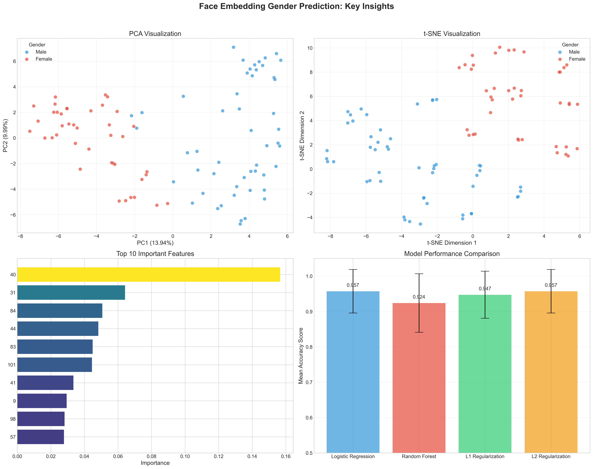

An all-in-one dashboard combining key insights from our analysis into a single comprehensive visualization.

## Insights

These visualizations reveal several key insights:

1. Face embeddings contain strong gender signals, as shown by the clear separation in both PCA and t-SNE plots

2. We only need a small subset of the 128 features to accurately predict gender

3. The models achieve high accuracy, with logistic regression performing particularly well

4. Regularization is important for preventing overfitting, especially given our small dataset

5. The learning curve suggests we could benefit from more training data, though performance is already excellent 